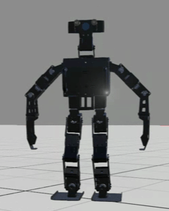

# Olá, Eu sou o Gustavo Brazilino! 👋

## 🤖 Estudante de Engenharia Mecatrônica | Apaixonado por Robótica 🤖

**Universidade Federal de Uberlândia (UFU), Brasil**

Sou um entusiasta da tecnologia, apaixonado por **inteligência artificial**, **automação** e **robótica no geral**. Atualmente, estou cursando Engenharia Mecatrônica na UFU, onde tenho a oportunidade de unir conhecimentos de mecânica, eletrônica e programação para criar soluções inovadoras.

**Minha missão:** Aprender, crescer e contribuir para projetos que impactam o mundo! 🚀

  

---

### 🛠️ Habilidades e Ferramentas

---

### 🚀 Projetos Destacados

#### 1. **Projeto de Fim de Curso - Método de Controle de Caminhada Humanoide**
   - Desenvolvimento de um método de controle de caminhada clássico para robôs humanoides.
   - Implementação e análise da teoria de controle proposta por Shuuji Kajita, focada na geração de padrões de caminhada estáveis utilizando o Ponto de Momento Zero (ZMP).

#### 2. **Contribuições de Desenvolvimento de Software para a Equipe EDROM**
   - Contribuição ativa para o repositório da EDROM (Equipe de Desenvolvimento em Robótica Móvel - UFU) no desenvolvimento de códigos para visão computacional, controle de movimento e tomada de decisões de robôs humanoides.
   - [Repositório da Equipe EDROM]([https://github.com/edromufu/])

#### 3. **Laboratório de Robótica (LAR) - UFU**
   - Projeto de **Desenvolvimento de um Robô Humanoide com Atuadores Lineares**.
   - O projeto foca no desenvolvimento de um robô humanoide de tamanha real movido por meio de atuadores lineares, explorando um mecanismo de movimento alternativo ao uso de motores seriais, otimizando a estrutura e a cinemática do robô.
   - Responsável pelo desenvolvimento da parte estrutural e elétrica do robô.

---

### 📊 Estatísticas do GitHub

---

### 📚 Formação e Experiência

- **Técnico em Informática**  
  *Concluído*   
- **Iniciação Científica** - Laboratório de Robótica - UFU  
  *Concluído*
- **Engenharia Mecatrônica** - Universidade Federal de Uberlândia (UFU)  
  *Cursando*  
- **Diretor de Estrutura** - Equipe EDROM  
  *Atual* 
- **Estagiário de Inovação** - Verry Máquinas  
  *Atual* 

---

### 🌟 Hobbies e Interesses

- 🤖 Robótica e Automação
- 📷 Visão Computacional e Machine Learning
- 🎮 Jogos Eletrônicos
- 📚 Leitura e Aprendizado Contínuo

---

### 📫 Contato

- [LinkedIn](https://www.linkedin.com/in/gbrazilino)  
- [Email](mailto:gustavobrazilino@gmail.com)  
- [Instagram](https://www.instagram.com/g_brazilino)

---

⭐️ **From [Gustavo Brazilino](https://github.com/Certezas)**
